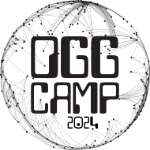
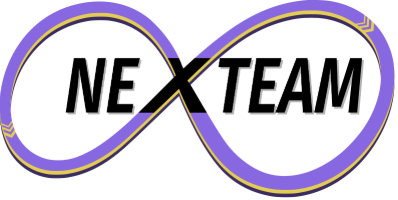
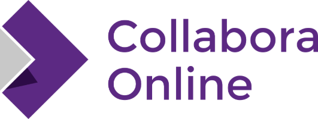
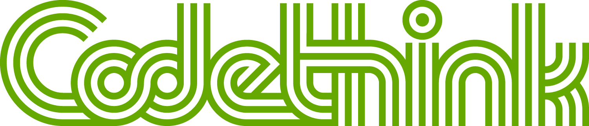

**After 5 years away, OggCamp is back in 2024!**

**OggCamp Tickets are now available!** Visit <a href="{{ site.baseurl }}/tickets/">tickets</a> to find out more and secure your place.

We're at <a href="https://www.pendulumhotel.co.uk/">**The Manchester Conference Centre**</a> in the Pendulum Hotel near Picadilly Station the weekend of **October 12th and 13th 2024**.

<!--
<h2>LATEST NEWS</h2>

<ul>
  
    <li>
      <a href="{{ post.url }}">{{ post.title }}</a> ({{ post.date | date_to_long_string }})
    </li>
  
</ul>

See more [news](/news).

-->
<h2>STAY IN TOUCH</h2>

Follow us on [Mastodon](https://mastodon.social/@oggcamp), [Bluesky](https://bsky.app/profile/oggcamp.bsky.social) or [Facebook](https://www.facebook.com/OggCamp) and we'll update you with any important news. There is also a [Telegram group](https://t.me/joinchat/AAAAAAsF-xo4ol9jAjNW8A), an [IRC channel](irc://irc.libera.chat/oggcamp)(also available via [WebChat](https://web.libera.chat/#oggcamp)), an [Matrix Room](https://matrix.to/#/#oggcamp:matrix.org) and a [Discord Server](https://discord.gg/4DcDk6Y).

<h2>THANK YOU TO OUR SPONSORS</h2> 
<table>
  <tr>
    <td></td>
    <td><a href="https://nexteam.co.uk/">Nexteam</a> is a network of technology professionals who passionately deliver successful outcomes with a fixed price agile process. We work to short iterative statements of work. Ensuring that we provide you the best value, the greatest flexibility and the least risk. Think of it as your on demand development team, who are always up for a challenge.
    </td>
  </tr>
  <tr>
    <td></td>
    <td><a href="https://www.collaboraonline.com/collabora-online/">Collabora Online</a> is based in Cambridge, and is a long-time supporter of the Open Source community and solutions. We are the largest contributors to the LibreOffice codebase, and are very pleased to be sponsoring OggCamp2024.
     
    We provide a powerful collaborative Office suite that supports all major document, spreadsheet and presentation file formats, which you can integrate into your own infrastructure. Collabora Online provides data security and sovereignty, and is ideally suited to the demands of a modern distributed working environment. Delivering a familiar look and feel, Collabora Online represents a real alternative to other big-brands solutions, giving you control and flexibility.
    </td>
  </tr>
  <tr>
    <td></td>
    <td><a href="https://www.codethink.co.uk">Codethink</a> has established an international reputation as a world-class provider of software engineering and consultancy services. Codethink delivers critical, high-performance software projects for international companies in a range of industries. We provide expert teams to help our clients tackle their most challenging software problems.
    </td>
  </tr>
</table>

<h2>WHAT IS AN OGGCAMP?</h2>

OggCamp is an unconference celebrating Free Culture, Free and Open Source Software, hardware hacking, digital rights, and all manner of collaborative cultural activities and is committed to creating a conference that is as inclusive as possible. If you've got a story to tell, no matter your background or current status, whether it's your first talk or you've loads of experience, as long as the talk is connected (somehow) to our theme then we want to know about it. You can find out what happens at an OggCamp by watching the video below:

<iframe class="YouTubeEmbed" src="https://www.youtube.com/embed/K15PIGuiLKw" width="853" height="480" frameborder="0" allowfullscreen="allowfullscreen"></iframe>