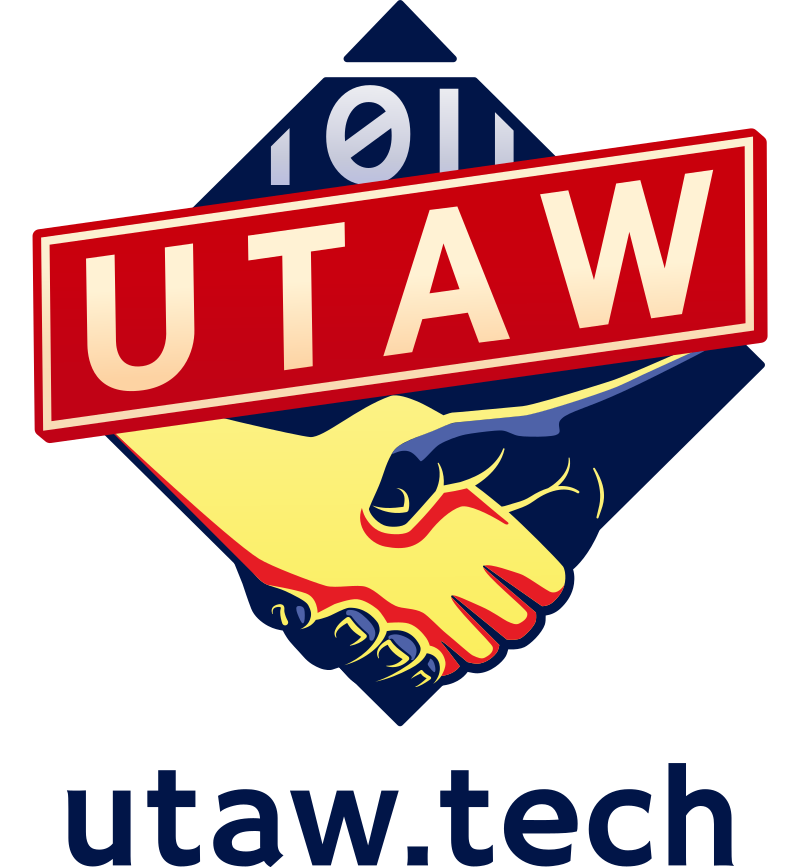

<h1>SPONSOR US</h1>
Although we strive to make attending OggCamp as accessible as possible, it does cost a considerable amount of money to put on. Each year we pay for venue hire, technical equipment, food, transport, stationary and a whole host of other random things. In order to do that we rely on the support of some wonderful sponsors.

Why Sponsor OggCamp? What's the _TLDR_?
- Visibility: Reach a diverse audience of tech enthusiasts, developers, and open-source advocates.
- Community Engagement: Show your commitment to the community and foster connections.
- Brand Exposure: Associate your brand with a respected event.
- Support a Great Cause: Help us keep OggCamp accessible to all.

If you or your company would like to sponsor the event please download our PDF sponsor pack which contains all the details you need.

<a href="/files/OggCamp2024SponsorPack.pdf"> <h2>DOWNLOAD SPONSOR PACK</h2></a>

We look forward to hearing from you! :-)

<h2>SPECIAL THANKS TO OUR SPONSORS FOR 2024</h2>
<table>
  <tr>
    <td>
      
    </td>
  </tr>
  <tr>
    <td>
      <b>OggCamp would like to thank UTAW for being our Pinnacle sponsor this year!</b>
       
      <a href="https://utaw.tech/">United Tech and Allied Workers</a> (UTAW) are a national branch of the Communication Workers Union (CWU) formed in 2020. We are the UK’s only union specifically for all workers in the tech industry, and we're proud to represent more tech workers than anyone else.
      The CWU campaigns nationally for workers in tech, telecoms, post and communications - offering legal support amongst other benefits, and providing a collective political voice for 180,000 workers.
    </td>
  </tr>
</table>
<table>
  <tr>
    <td></td>
    <td><a href="https://nexteam.co.uk/">Nexteam</a> is a network of technology professionals who passionately deliver successful outcomes with a fixed price agile process. We work to short iterative statements of work. Ensuring that we provide you the best value, the greatest flexibility and the least risk. Think of it as your on demand development team, who are always up for a challenge.
    </td>
  </tr>
  <tr>
    <td></td>
    <td><a href="https://www.collaboraonline.com/collabora-online/">Collabora Online</a> is based in Cambridge, and is a long-time supporter of the Open Source community and solutions. We are the largest contributors to the LibreOffice codebase, and are very pleased to be sponsoring OggCamp2024.
     
    We provide a powerful collaborative Office suite that supports all major document, spreadsheet and presentation file formats, which you can integrate into your own infrastructure. Collabora Online provides data security and sovereignty, and is ideally suited to the demands of a modern distributed working environment. Delivering a familiar look and feel, Collabora Online represents a real alternative to other big-brands solutions, giving you control and flexibility.
    </td>
  </tr>
  <tr>
    <td></td>
    <td><a href="https://www.codethink.co.uk">Codethink</a> has established an international reputation as a world-class provider of software engineering and consultancy services. Codethink delivers critical, high-performance software projects for international companies in a range of industries. We provide expert teams to help our clients tackle their most challenging software problems.
    </td>
  </tr>
</table>

